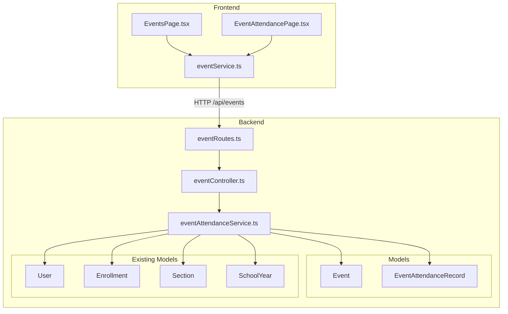
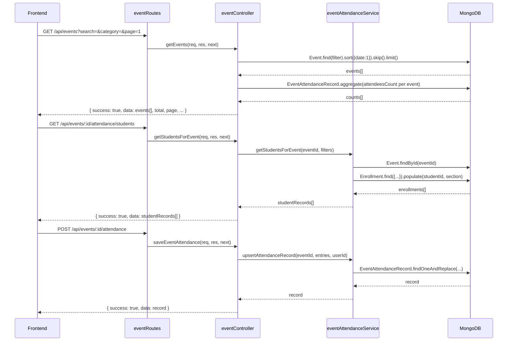
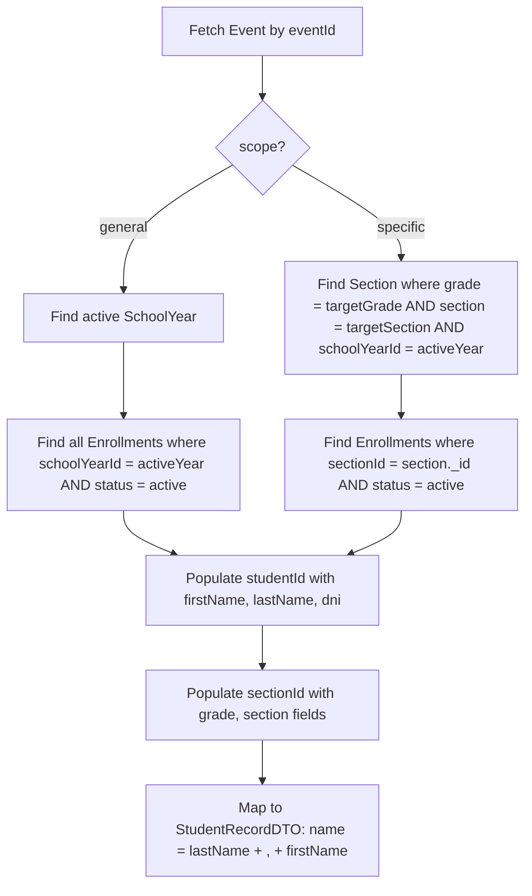

# Design Document — Events Backend Module

## Overview

This document describes the technical design for the Events Backend Module of EduMF. The module adds two new Mongoose models (`Event` and `EventAttendanceRecord`), a set of Express REST endpoints, and a frontend service module (`src/services/eventService.ts`) that replaces the mock data in `EventsPage.tsx` and `EventAttendancePage.tsx`.

The design follows the existing patterns in the codebase exactly:
- Mongoose models in `backend/src/models/`
- Express controllers in `backend/src/controllers/`
- Route files in `backend/src/routes/`
- Service helpers in `backend/src/services/`
- `ApiError` for error handling, `protect`/`authorize` for auth
- Response envelope: `{ success: true, data: ... }` / `{ success: false, message: ... }`

---

## Architecture



### Request / Response Flow



---

## Components and Interfaces

### Backend Components

| File | Responsibility |
|---|---|
| `backend/src/models/Event.ts` | Mongoose model for school events |
| `backend/src/models/EventAttendanceRecord.ts` | Mongoose model for per-event attendance |
| `backend/src/controllers/eventController.ts` | All request handlers for events and attendance |
| `backend/src/services/eventAttendanceService.ts` | Business logic: student list resolution, attendance upsert, summary computation |
| `backend/src/routes/eventRoutes.ts` | Express router wiring routes to controller handlers |

### Frontend Components

| File | Responsibility |
|---|---|
| `src/services/eventService.ts` | Typed API client for all event and attendance endpoints |

### Route Table

| Method | Path | Auth | Role | Handler |
|---|---|---|---|---|
| GET | `/api/events` | Public | — | `getEvents` |
| POST | `/api/events` | Required | admin, teacher | `createEvent` |
| GET | `/api/events/:id` | Public | — | `getEventById` |
| PUT | `/api/events/:id` | Required | admin, teacher | `updateEvent` |
| DELETE | `/api/events/:id` | Required | admin | `deleteEvent` |
| GET | `/api/events/:eventId/attendance/students` | Required | any | `getStudentsForEvent` |
| GET | `/api/events/:eventId/attendance/summary` | Required | any | `getEventAttendanceSummary` |
| GET | `/api/events/:eventId/attendance` | Required | any | `getEventAttendance` |
| POST | `/api/events/:eventId/attendance` | Required | admin, teacher | `saveEventAttendance` |
| PUT | `/api/events/:eventId/attendance` | Required | admin, teacher | `updateEventAttendance` |

---

## Data Models

### Event Model (`backend/src/models/Event.ts`)

```typescript
import mongoose, { Schema, Document } from 'mongoose';

export type EventCategory = 'Académico' | 'Artes' | 'Deportes' | 'Cultura' | 'Otro';
export type EventScope = 'general' | 'specific';

export interface IEvent extends Document {
  title: string;
  description?: string;
  category: EventCategory;
  date: Date;
  timeStart: string;   // HH:MM format
  timeEnd: string;     // HH:MM format
  location: string;
  imageUrl?: string;
  featured: boolean;
  scope: EventScope;
  targetGrade?: string;
  targetSection?: string;
  capacity?: number;
  createdAt: Date;
  updatedAt: Date;
}

const EventSchema: Schema = new Schema(
  {
    title: { type: String, required: true, trim: true },
    description: { type: String, trim: true },
    category: {
      type: String,
      enum: ['Académico', 'Artes', 'Deportes', 'Cultura', 'Otro'],
      required: true,
    },
    date: { type: Date, required: true },
    timeStart: { type: String, required: true },
    timeEnd: { type: String, required: true },
    location: { type: String, required: true, trim: true },
    imageUrl: { type: String, trim: true },
    featured: { type: Boolean, default: false },
    scope: {
      type: String,
      enum: ['general', 'specific'],
      default: 'general',
    },
    targetGrade: { type: String, trim: true },
    targetSection: { type: String, trim: true },
    capacity: { type: Number, min: 1 },
  },
  { timestamps: true }
);

// Validate that targetGrade and targetSection are present when scope is 'specific'
EventSchema.pre('validate', function (next) {
  if (this.scope === 'specific') {
    if (!this.targetGrade) {
      this.invalidate('targetGrade', 'targetGrade is required when scope is specific');
    }
    if (!this.targetSection) {
      this.invalidate('targetSection', 'targetSection is required when scope is specific');
    }
  }
  next();
});

// Expose _id as id, omit _id and __v
EventSchema.set('toJSON', {
  transform: (_doc, ret) => {
    ret.id = ret._id;
    delete ret._id;
    delete ret.__v;
    return ret;
  },
});

EventSchema.index({ date: 1 });
EventSchema.index({ category: 1 });
EventSchema.index({ featured: 1 });
EventSchema.index({ scope: 1, targetGrade: 1, targetSection: 1 });

export default mongoose.model<IEvent>('Event', EventSchema);
```

### EventAttendanceRecord Model (`backend/src/models/EventAttendanceRecord.ts`)

```typescript
import mongoose, { Schema, Document } from 'mongoose';

export type AttendanceStatus = 'present' | 'absent' | null;
export type TutorPresence = 'padre' | 'madre' | 'apoderado' | null;

export interface IStudentAttendanceEntry {
  studentId: mongoose.Types.ObjectId;
  attendance: AttendanceStatus;
  tutorPresence: TutorPresence;
  tutorName?: string;
}

export interface IEventAttendanceRecord extends Document {
  eventId: mongoose.Types.ObjectId;
  submittedBy: mongoose.Types.ObjectId;
  submittedAt: Date;
  entries: IStudentAttendanceEntry[];
  createdAt: Date;
  updatedAt: Date;
}

const StudentAttendanceEntrySchema = new Schema(
  {
    studentId: {
      type: mongoose.Schema.Types.ObjectId,
      ref: 'User',
      required: true,
    },
    attendance: {
      type: String,
      enum: ['present', 'absent', null],
      default: null,
    },
    tutorPresence: {
      type: String,
      enum: ['padre', 'madre', 'apoderado', null],
      default: null,
    },
    tutorName: { type: String, trim: true },
  },
  { _id: false }
);

const EventAttendanceRecordSchema: Schema = new Schema(
  {
    eventId: {
      type: mongoose.Schema.Types.ObjectId,
      ref: 'Event',
      required: true,
      unique: true,   // one record per event (upsert pattern)
    },
    submittedBy: {
      type: mongoose.Schema.Types.ObjectId,
      ref: 'User',
      required: true,
    },
    submittedAt: { type: Date, default: Date.now },
    entries: [StudentAttendanceEntrySchema],
  },
  { timestamps: true }
);

EventAttendanceRecordSchema.set('toJSON', {
  transform: (_doc, ret) => {
    ret.id = ret._id;
    delete ret._id;
    delete ret.__v;
    return ret;
  },
});

EventAttendanceRecordSchema.index({ eventId: 1 }, { unique: true });

export default mongoose.model<IEventAttendanceRecord>(
  'EventAttendanceRecord',
  EventAttendanceRecordSchema
);
```

**Design decisions:**
- One `EventAttendanceRecord` per event (enforced by unique index on `eventId`). Saves use `findOneAndReplace` (upsert), so POST and PUT both converge to the same operation — this avoids a "record already exists" conflict on the first save.
- `entries` is an embedded array rather than a separate collection. Event attendance is always read and written as a whole unit, so embedding avoids extra round-trips and keeps the document self-contained.
- `attendance` and `tutorPresence` allow `null` to represent "not yet recorded", matching the frontend's `AttendanceStatus` and `TutorPresence` types exactly.
- Validation of `tutorName` required when `tutorPresence === 'apoderado'` and `tutorPresence` must be `null` when `attendance === 'absent'` is enforced in the service layer (not the schema) to produce clear HTTP 400 responses with descriptive messages.

---

### Frontend Types (`src/services/eventService.ts` — type section)

```typescript
// Matches the Event interface in EventsPage.tsx
export interface EventDTO {
  id: string;
  title: string;
  description: string;
  category: 'Académico' | 'Artes' | 'Deportes' | 'Cultura' | 'Otro';
  date: string;          // ISO date string
  timeStart: string;
  timeEnd: string;
  location: string;
  imageUrl?: string;
  attendeesCount: number;
  featured: boolean;
  scope: 'general' | 'specific';
  targetGrade?: string;
  targetSection?: string;
  capacity?: number;
}

// Matches the StudentRecord interface in EventAttendancePage.tsx
export interface StudentRecordDTO {
  id: string;
  name: string;          // "Apellido, Nombre"
  studentId: string;     // dni
  grade: string;
  section: string;
  attendance: 'present' | 'absent' | null;
  tutorPresence: 'padre' | 'madre' | 'apoderado' | null;
  tutorName: string;
}

export interface AttendanceSummaryDTO {
  totalStudents: number;
  presentCount: number;
  absentCount: number;
  notRecordedCount: number;
  tutorCount: number;
  attendanceRate: number;  // 0–100, rounded integer
}

export interface PaginatedEventsResponse {
  success: boolean;
  data: EventDTO[];
  total: number;
  page: number;
  limit: number;
  totalPages: number;
}
```

---

## Integration Points with Existing Models

### Enrollment → Student List Resolution

When `GET /api/events/:eventId/attendance/students` is called, the service resolves the student list as follows:



**Key query for general scope:**
```typescript
const activeYear = await SchoolYear.findOne({ status: 'Activo' });
const enrollments = await Enrollment.find({
  schoolYearId: activeYear._id,
  status: 'active',
})
  .populate('studentId', 'firstName lastName dni')
  .populate('sectionId', 'grade section');
```

**Key query for specific scope:**
```typescript
const section = await Section.findOne({
  grade: event.targetGrade,
  section: event.targetSection,
  schoolYearId: activeYear._id,
});
const enrollments = await Enrollment.find({
  sectionId: section._id,
  status: 'active',
})
  .populate('studentId', 'firstName lastName dni')
  .populate('sectionId', 'grade section');
```

### attendeesCount Computation

The `getEvents` controller computes `attendeesCount` for each event in the list using a single aggregation pipeline after fetching the events page:

```typescript
const eventIds = events.map(e => e._id);
const counts = await EventAttendanceRecord.aggregate([
  { $match: { eventId: { $in: eventIds } } },
  { $unwind: '$entries' },
  { $match: { 'entries.attendance': 'present' } },
  { $group: { _id: '$eventId', count: { $sum: 1 } } },
]);
// Merge counts into event DTOs
```

This avoids N+1 queries when listing events.

---

## Correctness Properties

*A property is a characteristic or behavior that should hold true across all valid executions of a system — essentially, a formal statement about what the system should do. Properties serve as the bridge between human-readable specifications and machine-verifiable correctness guarantees.*

### Property 1: Event serialization omits internal fields

*For any* Event document stored in MongoDB, the JSON response returned by the API should contain an `id` field equal to the document's `_id`, and should not contain `_id` or `__v` fields.

**Validates: Requirements 1.3**

---

### Property 2: Specific-scope events require targetGrade and targetSection

*For any* POST or PUT request to `/api/events` where `scope` is `specific` and either `targetGrade` or `targetSection` is absent or empty, the API should return HTTP 400.

**Validates: Requirements 1.4**

---

### Property 3: Event list is always sorted by date ascending

*For any* collection of events with varying dates, a GET request to `/api/events` should return events in ascending order of `date`, regardless of insertion order.

**Validates: Requirements 2.2**

---

### Property 4: Event retrieval round-trip

*For any* event created via POST, a subsequent GET to `/api/events/:id` using the returned `id` should return a document with the same field values as the creation payload.

**Validates: Requirements 2.3**

---

### Property 5: Missing required fields always produce HTTP 400

*For any* POST or PUT request to `/api/events` that omits one or more required fields (`title`, `category`, `date`, `timeStart`, `timeEnd`, `location`), the API should return HTTP 400 with a non-empty error message.

**Validates: Requirements 2.6**

---

### Property 6: Search filter returns only matching events

*For any* non-empty search string, all events returned by `GET /api/events?search=<query>` should have a `title` or `description` that contains the search string (case-insensitive). No event whose title and description both lack the search string should appear in the results.

**Validates: Requirements 3.1**

---

### Property 7: Category filter returns only matching events

*For any* valid `EventCategory` value, all events returned by `GET /api/events?category=<value>` should have `category` equal to that value.

**Validates: Requirements 3.2, 3.3**

---

### Property 8: Pagination metadata is consistent with results

*For any* `page` and `limit` values, the response to `GET /api/events` should contain at most `limit` items in `data`, and the `totalPages` field should equal `Math.ceil(total / limit)`.

**Validates: Requirements 3.4**

---

### Property 9: apoderado entries require tutorName

*For any* save request to `/api/events/:eventId/attendance` where any entry has `tutorPresence === 'apoderado'` and `tutorName` is absent or empty, the API should return HTTP 400.

**Validates: Requirements 4.3, 6.4**

---

### Property 10: Absent students cannot have tutor presence

*For any* save request to `/api/events/:eventId/attendance` where any entry has `attendance === 'absent'` and `tutorPresence` is not `null`, the API should return HTTP 400.

**Validates: Requirements 4.4, 6.5**

---

### Property 11: Student records have the correct shape and name format

*For any* enrolled student returned by `GET /api/events/:eventId/attendance/students`, the record should contain `id`, `name` (formatted as `"Apellido, Nombre"`), `studentId` (equal to the student's `dni`), `grade`, and `section`.

**Validates: Requirements 5.4, 10.2**

---

### Property 12: Scope-based student filtering

*For any* event with `scope === 'specific'`, all students returned by `GET /api/events/:eventId/attendance/students` should be enrolled in the section matching `targetGrade` and `targetSection`. For `scope === 'general'`, all returned students should be active enrollments in the active school year.

**Validates: Requirements 5.2, 5.3**

---

### Property 13: Save records submittedBy and submittedAt

*For any* POST or PUT to `/api/events/:eventId/attendance` made by an authenticated user, the saved `EventAttendanceRecord` should have `submittedBy` equal to the authenticated user's ID and `submittedAt` set to a timestamp within a few seconds of the request time.

**Validates: Requirements 6.3**

---

### Property 14: Attendance retrieval round-trip with populated entries

*For any* saved `EventAttendanceRecord`, a subsequent GET to `/api/events/:eventId/attendance` should return the same entries, with each `studentId` populated with `firstName`, `lastName`, and `dni`.

**Validates: Requirements 7.1, 7.3**

---

### Property 15: Summary statistics are consistent with entries

*For any* `EventAttendanceRecord`, the summary returned by `GET /api/events/:eventId/attendance/summary` should satisfy:
- `presentCount` = count of entries where `attendance === 'present'`
- `absentCount` = count of entries where `attendance === 'absent'`
- `notRecordedCount` = count of entries where `attendance === null`
- `tutorCount` = count of entries where `tutorPresence !== null`
- `attendanceRate` = `Math.round((presentCount / totalStudents) * 100)`, or `0` when `totalStudents === 0`

**Validates: Requirements 7.4, 8.1, 8.3**

---

### Property 16: attendeesCount in event list matches present entries

*For any* event with a saved `EventAttendanceRecord`, the `attendeesCount` field in the event list response should equal the number of entries in that record where `attendance === 'present'`.

**Validates: Requirements 10.3**

---

### Property 17: Protected routes reject unauthenticated requests

*For any* request to a protected event or attendance route (all routes except `GET /api/events` and `GET /api/events/:id`) that does not include a valid Bearer JWT token, the API should return HTTP 401.

**Validates: Requirements 9.1, 9.2, 9.3**

---

### Property 18: Role-based authorization on write operations

*For any* DELETE request to `/api/events/:id` made by an authenticated user without the `admin` role, the API should return HTTP 403. For any POST or PUT to `/api/events` made by a user without `admin` or `teacher` role, the API should return HTTP 403.

**Validates: Requirements 9.4, 9.5**

---

### Property 19: Success responses always use the standard envelope

*For any* successful request to any event or attendance endpoint, the response body should have `success: true` and a `data` field containing the payload.

**Validates: Requirements 11.2, 11.3**

---

## Error Handling

All error handling follows the existing pattern in the codebase.

### Error Sources and Responses

| Condition | HTTP Status | Handler |
|---|---|---|
| Missing required field | 400 | `ApiError.badRequest(message)` |
| Invalid enum value (category, scope) | 400 | `ApiError.badRequest(message)` |
| `tutorPresence === 'apoderado'` without `tutorName` | 400 | `ApiError.badRequest(...)` |
| `attendance === 'absent'` with non-null `tutorPresence` | 400 | `ApiError.badRequest(...)` |
| Duplicate `studentId` in entries array | 400 | `ApiError.badRequest(...)` |
| Event not found | 404 | `ApiError.notFound(...)` |
| Attendance record not found | 404 | `ApiError.notFound(...)` |
| No active SchoolYear found | 404 | `ApiError.notFound(...)` |
| No matching Section found (specific scope) | 404 | `ApiError.notFound(...)` |
| Unauthenticated request to protected route | 401 | `protect` middleware |
| Insufficient role | 403 | `authorize(...)` middleware |
| Unhandled exception | 500 | `next(error)` → global `errorHandler` |

### Validation Strategy

Business rule validation (tutor/attendance consistency, scope field requirements) is performed in the service layer (`eventAttendanceService.ts`) rather than in Mongoose validators. This produces clear, user-facing HTTP 400 responses with descriptive messages, consistent with how the existing `attendanceController.ts` handles validation.

Mongoose schema-level validation handles type coercion and enum membership. The `pre('validate')` hook on `EventSchema` enforces the `scope === 'specific'` → `targetGrade`/`targetSection` rule.

---

## Testing Strategy

### Unit Tests

Unit tests cover specific examples, edge cases, and error conditions for the service layer:

- `eventAttendanceService.getStudentsForEvent`: verify correct student list for general vs. specific scope events
- `eventAttendanceService.validateEntries`: verify all validation rules (apoderado/tutorName, absent/tutorPresence, duplicate studentIds)
- `eventAttendanceService.computeSummary`: verify summary statistics computation with known inputs, including the division-by-zero case
- `eventController.getEvents`: verify search, category, featured, and pagination filters with mock data

### Property-Based Tests

Property-based tests use a PBT library appropriate for the TypeScript/Node.js stack. The recommended library is **fast-check** (`npm install --save-dev fast-check`), which is well-maintained, TypeScript-native, and widely used in the Node.js ecosystem.

Each property test runs a minimum of **100 iterations**.

Each test is tagged with a comment in the format:
`// Feature: events-backend-module, Property <N>: <property_text>`

**Properties to implement as property-based tests:**

| Property | Test approach |
|---|---|
| P1: Event serialization | Generate random event data, save, retrieve, verify `id` present and `_id`/`__v` absent |
| P2: Specific scope validation | Generate events with `scope=specific` and missing targetGrade/targetSection, verify 400 |
| P3: Event list sort order | Generate N events with random dates, verify response is sorted ascending |
| P5: Missing required fields → 400 | Generate requests with random subsets of required fields omitted, verify 400 |
| P6: Search filter correctness | Generate events with random titles/descriptions and search queries, verify all results match |
| P7: Category filter correctness | Generate events with random categories, filter by each, verify all results match |
| P8: Pagination metadata | Generate random page/limit values, verify `totalPages = ceil(total/limit)` and `data.length ≤ limit` |
| P9: apoderado requires tutorName | Generate entries with `tutorPresence=apoderado` and empty/missing tutorName, verify 400 |
| P10: Absent + tutor → 400 | Generate entries with `attendance=absent` and non-null tutorPresence, verify 400 |
| P11: Student record shape | Generate enrollments, verify each returned record has correct fields and name format |
| P15: Summary statistics | Generate random entries arrays, verify summary counts match manual computation |
| P16: attendeesCount | Generate attendance records with random present counts, verify event list attendeesCount matches |
| P17: Auth protection | Generate requests to protected routes without tokens, verify 401 |
| P18: Role authorization | Generate requests with non-admin/non-teacher tokens, verify 403 |
| P19: Success envelope | Generate valid requests, verify `success: true` and `data` field present |

### Integration Tests

Integration tests run against a test MongoDB instance (e.g., `mongodb-memory-server`) and cover end-to-end flows:

- Full event CRUD lifecycle (create → read → update → delete)
- Attendance save and retrieve round-trip
- Student list resolution for general and specific scope events
- `attendeesCount` computation in event list after saving attendance
- Authentication and authorization middleware integration

### Frontend Service Tests

The `eventService.ts` module is tested with mocked `axios` responses to verify:
- Correct URL construction for all methods
- Correct request body serialization
- Correct response data extraction
