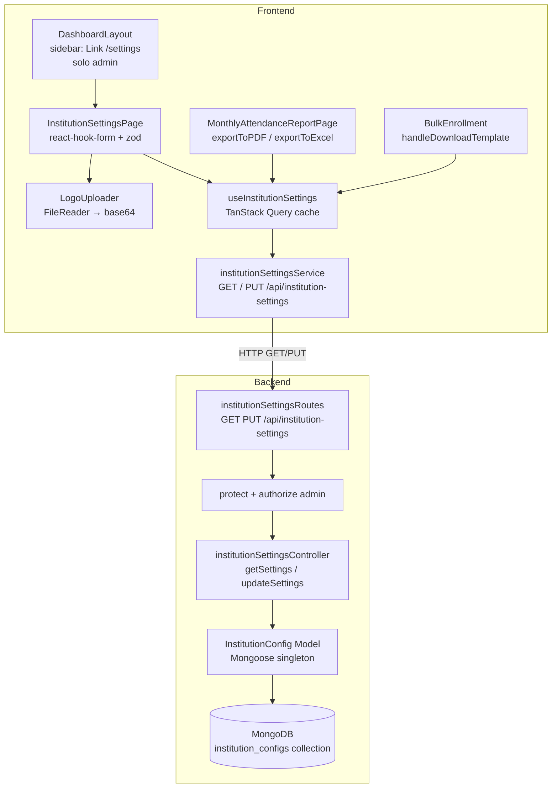
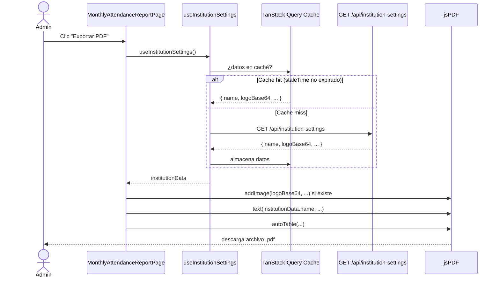

# Documento de Diseño Técnico: institution-settings

## Resumen de Investigación

Antes de escribir el diseño se revisaron los siguientes artefactos del proyecto:

- **Backend**: patrón de controladores (`userController.ts`), middleware de auth (`authMiddleware.ts`), manejo de errores (`errorHandler.ts`), registro de rutas en `server.ts`, modelos Mongoose existentes (`Staff.ts` como referencia de esquema).
- **Frontend**: `App.tsx` (registro de rutas), `DashboardLayout.tsx` (sidebar con botón "Configuración" ya presente pero sin ruta), `AuthContext.tsx` (expone `user.role`), `api.ts` (instancia axios con interceptores JWT), `MonthlyAttendanceReportPage.tsx` (exportación PDF con jsPDF + autoTable y Excel con xlsx + file-saver), `BulkEnrollment.tsx` (generación de plantilla Excel con xlsx).
- **Design system**: `DESIGN_SYSTEM.md` — `rounded-2xl`, `border border-gray-100`, `shadow-sm`, color primario `#538f65`, sidebar `#1e2433`.
- **Dependencias disponibles**: backend tiene `fast-check` para PBT; frontend tiene `@tanstack/react-query`, `react-hook-form`, `zod`, `sonner`, `jspdf`, `jspdf-autotable`, `xlsx`, `file-saver`.

**Hallazgos clave que informan el diseño:**

1. El botón "Configuración" en `DashboardLayout.tsx` es un `<button>` sin `href` — debe convertirse en `<Link to="/settings">` y mostrarse condicionalmente según `user.role === 'admin'`.
2. `MonthlyAttendanceReportPage.tsx` tiene `exportToPDF()` y `exportToExcel()` como funciones locales — se refactorizarán para recibir los datos institucionales como parámetro, obtenidos del hook compartido `useInstitutionSettings`.
3. `BulkEnrollment.tsx` tiene `handleDownloadTemplate()` como función local — se refactorizará de la misma manera.
4. El patrón singleton en MongoDB se implementa con `findOneAndUpdate({ }, data, { upsert: true, new: true, setDefaultsOnInsert: true })` sin filtro de ID, garantizando un único documento.
5. El backend ya tiene `express-validator` disponible para validaciones de campos.
6. TanStack Query v5 está instalado — se usará `staleTime` para caché y `invalidateQueries` tras mutación.

---

## Visión General

El módulo **institution-settings** permite a los administradores de EduMF registrar y mantener los datos de identidad de la institución educativa: nombre, logo (base64), dirección, teléfono y correo electrónico. Esta información se inyecta automáticamente como encabezado institucional en todos los documentos generados por el sistema (plantillas Excel de importación, reportes PDF y archivos Excel exportados).

El módulo es de acceso exclusivo para usuarios con rol `admin`. El logo se almacena como string base64 en MongoDB, sin archivos en disco ni multer. La conversión a base64 ocurre en el frontend con la API `FileReader` del navegador.

---

## Arquitectura



### Flujo principal: Guardar configuración

```mermaid
sequenceDiagram
    actor Admin
    participant Page as InstitutionSettingsPage
    participant Uploader as LogoUploader
    participant Service as institutionSettingsService
    participant API as PUT /api/institution-settings
    participant DB as MongoDB

    Admin->>Page: Abre /settings
    Page->>Service: GET /api/institution-settings
    Service-->>Page: { name, address, phone, email, logoBase64 }
    Page->>Page: Rellena formulario con valores actuales

    Admin->>Uploader: Selecciona imagen (PNG/JPEG/WEBP ≤ 2MB)
    Uploader->>Uploader: FileReader.readAsDataURL()
    Uploader-->>Page: logoBase64 = "data:image/png;base64,..."

    Admin->>Page: Clic "Guardar"
    Page->>Page: zod.parse() — valida campos
    Page->>Service: PUT /api/institution-settings { name, address, phone, email, logoBase64 }
    Service->>API: HTTP PUT con Bearer token
    API->>DB: findOneAndUpdate({}, data, { upsert: true })
    DB-->>API: documento actualizado
    API-->>Service: 200 { success: true, data: {...} }
    Service-->>Page: datos actualizados
    Page->>Page: invalidateQueries(['institutionSettings'])
    Page->>Admin: toast.success("Configuración guardada")
```

### Flujo: Exportación con encabezado institucional



---

## Componentes e Interfaces

### Backend

#### `InstitutionConfig` (Modelo Mongoose)

Archivo: `backend/src/models/InstitutionConfig.ts`

```typescript
interface IInstitutionConfig extends Document {
  name: string;           // Nombre de la institución (requerido)
  address?: string;       // Dirección (opcional)
  phone?: string;         // Teléfono (opcional)
  email?: string;         // Correo electrónico (opcional, validado con regex)
  logoBase64?: string;    // Logo en base64 con prefijo data:image/...;base64,...
  createdAt: Date;
  updatedAt: Date;
}
```

#### `institutionSettingsController`

Archivo: `backend/src/controllers/institutionSettingsController.ts`

```typescript
// GET /api/institution-settings
// Retorna el documento singleton o un objeto vacío con HTTP 200
getSettings(req, res, next): Promise<void>

// PUT /api/institution-settings
// Valida y persiste los campos; retorna el documento actualizado con HTTP 200
updateSettings(req, res, next): Promise<void>
```

#### `institutionSettingsRoutes`

Archivo: `backend/src/routes/institutionSettingsRoutes.ts`

```
GET  /api/institution-settings  → protect → authorize('admin') → getSettings
PUT  /api/institution-settings  → protect → authorize('admin') → updateSettings
```

Validaciones con `express-validator` en la ruta PUT:
- `name`: no vacío, no solo espacios en blanco
- `email`: si se proporciona, debe ser email válido

### Frontend

#### `institutionSettingsService`

Archivo: `src/services/institutionSettingsService.ts`

```typescript
interface InstitutionSettings {
  name: string;
  address?: string;
  phone?: string;
  email?: string;
  logoBase64?: string;
}

const institutionSettingsService = {
  getSettings: (): Promise<InstitutionSettings>
  updateSettings: (data: InstitutionSettings): Promise<InstitutionSettings>
}
```

#### `useInstitutionSettings` (TanStack Query hook)

Archivo: `src/hooks/useInstitutionSettings.ts`

```typescript
// Hook de lectura — caché compartida entre todos los consumidores
function useInstitutionSettings(): {
  data: InstitutionSettings | undefined;
  isLoading: boolean;
  error: Error | null;
}

// Hook de mutación — invalida caché tras éxito
function useUpdateInstitutionSettings(): UseMutationResult<
  InstitutionSettings,
  Error,
  InstitutionSettings
>
```

Configuración de caché:
- `queryKey: ['institutionSettings']`
- `staleTime: 5 * 60 * 1000` (5 minutos — los datos institucionales cambian raramente)
- `gcTime: 10 * 60 * 1000`

#### `LogoUploader`

Componente interno de `InstitutionSettingsPage`.

```typescript
interface LogoUploaderProps {
  value?: string;           // logoBase64 actual
  onChange: (base64: string | undefined) => void;
  onError: (message: string) => void;
}
```

Responsabilidades:
- Validar tipo MIME: solo `image/png`, `image/jpeg`, `image/webp`
- Validar tamaño: máximo 2 MB
- Convertir con `FileReader.readAsDataURL()`
- Mostrar previsualización si `value` existe
- Mostrar placeholder con ícono si `value` es undefined

#### `InstitutionSettingsPage`

Archivo: `src/pages/InstitutionSettingsPage.tsx`

```typescript
// Formulario con react-hook-form + zod
// Schema de validación:
const schema = z.object({
  name: z.string().min(1, 'El nombre es requerido').trim(),
  address: z.string().optional(),
  phone: z.string().optional(),
  email: z.string().email('Correo inválido').optional().or(z.literal('')),
  logoBase64: z.string().optional(),
});
```

#### Modificaciones a `DashboardLayout`

- Convertir el `<button>` de "Configuración" en `<Link to="/settings">` con el mismo estilo visual.
- Envolver en condición `{user?.role === 'admin' && ...}` para ocultarlo a roles no-admin.
- Aplicar estado activo (`style={{ background: '#538f65' }}`) cuando `location.pathname === '/settings'`.

#### Modificaciones a `MonthlyAttendanceReportPage`

- Agregar `const { data: institutionData } = useInstitutionSettings()` al componente.
- Refactorizar `exportToPDF()` para recibir `institutionData` y llamar a `addInstitutionHeader(doc, institutionData)`.
- Refactorizar `exportToExcel()` para recibir `institutionData` y agregar fila de encabezado institucional.

#### Modificaciones a `BulkEnrollment`

- Agregar `const { data: institutionData } = useInstitutionSettings()` al componente.
- Refactorizar `handleDownloadTemplate()` para incluir el nombre institucional en la celda de encabezado.

#### Helper `addInstitutionHeader`

Archivo: `src/utils/institutionHeader.ts`

```typescript
// Inserta el encabezado institucional en un documento jsPDF
// Retorna el valor Y donde debe comenzar el contenido del reporte
function addInstitutionHeaderToPDF(
  doc: jsPDF,
  settings: InstitutionSettings | undefined,
  reportTitle: string
): number

// Inserta el encabezado institucional en una hoja de trabajo XLSX
// Retorna el número de fila donde debe comenzar el contenido
function addInstitutionHeaderToSheet(
  ws: XLSX.WorkSheet,
  settings: InstitutionSettings | undefined
): number
```

#### Modificación a `App.tsx`

```tsx
// Agregar import
import InstitutionSettingsPage from '@/pages/InstitutionSettingsPage';

// Agregar ruta dentro del layout protegido
<Route path="settings" element={<AdminRoute><InstitutionSettingsPage /></AdminRoute>} />
```

Componente `AdminRoute`:
```typescript
function AdminRoute({ children }: { children: React.ReactNode }) {
  const { user } = useAuth();
  if (user?.role !== 'admin') return <Navigate to="/" replace />;
  return <>{children}</>;
}
```

---

## Modelos de Datos

### MongoDB: Colección `institution_configs`

```json
{
  "_id": ObjectId,
  "name": "Institución Educativa San Martín",
  "address": "Av. Principal 123, Lima",
  "phone": "01-234-5678",
  "email": "contacto@sanmartin.edu.pe",
  "logoBase64": "data:image/png;base64,iVBORw0KGgoAAAANSUhEUgAA...",
  "createdAt": ISODate("2024-01-15T10:00:00Z"),
  "updatedAt": ISODate("2024-03-20T14:30:00Z")
}
```

**Restricciones del esquema Mongoose:**
- `name`: `String`, `required: true`, `trim: true`
- `address`: `String`, `trim: true`, `default: ''`
- `phone`: `String`, `trim: true`, `default: ''`
- `email`: `String`, `trim: true`, `lowercase: true`, `match: [/^\S+@\S+\.\S+$/, ...]`, `default: ''`
- `logoBase64`: `String`, `default: ''`
- `timestamps: true`

**Patrón singleton:** No se usa un campo `_id` fijo. El controlador usa:
```typescript
InstitutionConfig.findOneAndUpdate(
  {},                          // sin filtro → primer (y único) documento
  { $set: updateData },
  { upsert: true, new: true, setDefaultsOnInsert: true, runValidators: true }
)
```

### Tipo TypeScript compartido (frontend)

```typescript
// src/types/institution.ts
export interface InstitutionSettings {
  name: string;
  address: string;
  phone: string;
  email: string;
  logoBase64: string;
}

export interface InstitutionSettingsResponse {
  success: boolean;
  data: InstitutionSettings;
}
```

---

## Propiedades de Corrección

*Una propiedad es una característica o comportamiento que debe ser verdadero en todas las ejecuciones válidas de un sistema — esencialmente, una declaración formal sobre lo que el sistema debe hacer. Las propiedades sirven como puente entre las especificaciones legibles por humanos y las garantías de corrección verificables por máquinas.*

### Propiedad 1: Round-trip de persistencia de configuración

*Para cualquier* objeto `InstitutionSettings` válido (con `name` no vacío y `email` con formato válido o vacío), enviarlo mediante `PUT /api/institution-settings` y luego recuperarlo con `GET /api/institution-settings` debe retornar un objeto con los mismos valores en todos los campos.

**Valida: Requisitos 1.2, 1.4, 3.5**

### Propiedad 2: Rechazo de nombre vacío o solo espacios en blanco

*Para cualquier* string compuesto únicamente de espacios en blanco (incluyendo el string vacío, strings de solo espacios, tabs o saltos de línea) enviado como campo `name` en `PUT /api/institution-settings`, la API debe retornar HTTP 400 y el documento en base de datos no debe ser modificado.

**Valida: Requisito 1.5**

### Propiedad 3: Rechazo de correo electrónico con formato inválido

*Para cualquier* string que no cumpla el patrón `usuario@dominio.extensión` enviado como campo `email` en `PUT /api/institution-settings`, la API debe retornar HTTP 400.

**Valida: Requisito 1.6**

### Propiedad 4: Control de acceso por rol

*Para cualquier* rol de usuario distinto de `admin` (es decir, `teacher` o `student`), las solicitudes autenticadas a `GET /api/institution-settings` y `PUT /api/institution-settings` deben retornar HTTP 403.

**Valida: Requisito 2.2**

### Propiedad 5: Validación de tipo MIME en LogoUploader

*Para cualquier* archivo cuyo tipo MIME no sea `image/png`, `image/jpeg` ni `image/webp`, el componente `LogoUploader` debe rechazarlo (no llamar a `FileReader.readAsDataURL`) y emitir un mensaje de error al usuario.

**Valida: Requisito 3.1, 3.2**

### Propiedad 6: Formato correcto de la conversión base64

*Para cualquier* archivo de imagen válido con tipo MIME `image/png`, `image/jpeg` o `image/webp`, la función de conversión del `LogoUploader` debe producir un string que comience con `data:image/` y contenga `;base64,`.

**Valida: Requisito 3.4**

### Propiedad 7: El formulario muestra los valores cargados

*Para cualquier* objeto `InstitutionSettings` retornado por la API, al renderizar `InstitutionSettingsPage` con ese objeto como respuesta mockeada, cada campo del formulario debe mostrar el valor correspondiente del objeto.

**Valida: Requisito 4.2**

### Propiedad 8: Los documentos generados incluyen el nombre institucional en el encabezado

*Para cualquier* nombre de institución no vacío configurado en `InstitutionSettings`, todos los documentos generados por el sistema (PDF de reporte de asistencia, Excel exportado, plantilla Excel de importación) deben contener ese nombre en su sección de encabezado.

**Valida: Requisitos 5.1, 6.1, 7.1**

---

## Manejo de Errores

### Backend

| Escenario | Código HTTP | Mensaje |
|---|---|---|
| Sin token de autenticación | 401 | "No hay token, autorización denegada" |
| Token inválido o expirado | 401 | "Token inválido" |
| Rol no autorizado (no admin) | 403 | "No tiene permiso para realizar esta acción" |
| Campo `name` vacío o solo espacios | 400 | "El nombre de la institución es requerido" |
| Campo `email` con formato inválido | 400 | "El correo electrónico no tiene un formato válido" |
| Error interno de MongoDB | 500 | "Error interno del servidor" |

El controlador usa el patrón `try/catch` con `next(error)` para delegar al `errorHandler` global existente. Las validaciones de campos se realizan con `express-validator` antes de llegar al controlador.

### Frontend

| Escenario | Comportamiento |
|---|---|
| Error al cargar configuración | Muestra mensaje de error en la página con opción de reintentar |
| Error al guardar (400 validación) | `toast.error(error.response.data.message)` con el mensaje del servidor |
| Error al guardar (401/403) | El interceptor de axios redirige a `/login` (401) o muestra toast de error (403) |
| Error al guardar (500) | `toast.error("Error al guardar la configuración")` |
| Archivo de logo con tipo inválido | Mensaje inline bajo el uploader: "Solo se permiten archivos PNG, JPEG o WEBP" |
| Archivo de logo mayor a 2 MB | Mensaje inline bajo el uploader: "El archivo no debe superar 2 MB" |
| Exportación sin datos institucionales | Se genera el documento sin encabezado institucional (degradación elegante) |

### Degradación elegante en exportaciones

Si `useInstitutionSettings` retorna `undefined` (error de red, primera carga), las funciones de exportación deben generar el documento sin encabezado institucional en lugar de fallar. El helper `addInstitutionHeaderToPDF` y `addInstitutionHeaderToSheet` manejan `settings === undefined` retornando la posición Y inicial sin modificar el documento.

---

## Estrategia de Testing

### Enfoque dual

Se combinan tests de ejemplo (unitarios/integración) con tests basados en propiedades (PBT) usando `fast-check` (ya instalado en el backend como devDependency).

### Tests de propiedades (PBT) — Backend

Usar `fast-check` con mínimo 100 iteraciones por propiedad. Cada test referencia la propiedad del diseño con el tag:
`Feature: institution-settings, Property {N}: {texto}`

**Propiedad 1 — Round-trip de persistencia:**
```typescript
// fast-check genera: name (string no vacío), address, phone, email (válido o vacío), logoBase64
// Acción: PUT → GET
// Aserción: todos los campos del GET coinciden con los del PUT
```

**Propiedad 2 — Rechazo de nombre vacío:**
```typescript
// fast-check genera: strings de solo espacios en blanco (fc.stringOf(fc.constantFrom(' ', '\t', '\n')))
// Aserción: respuesta HTTP 400
```

**Propiedad 3 — Rechazo de email inválido:**
```typescript
// fast-check genera: strings que no coinciden con /^\S+@\S+\.\S+$/
// Aserción: respuesta HTTP 400
```

**Propiedad 4 — Control de acceso por rol:**
```typescript
// fast-check genera: roles de ['teacher', 'student']
// Aserción: respuesta HTTP 403 para GET y PUT
```

### Tests de propiedades (PBT) — Frontend

Usar `fast-check` con `vitest` o `jest` para las propiedades del frontend.

**Propiedad 5 — Validación de tipo MIME:**
```typescript
// fast-check genera: strings de MIME type que no son image/png, image/jpeg, image/webp
// Aserción: onChange no es llamado, onError sí es llamado
```

**Propiedad 6 — Formato base64:**
```typescript
// fast-check genera: archivos mock con MIME válido
// Aserción: resultado comienza con "data:image/" y contiene ";base64,"
```

**Propiedad 7 — Formulario muestra valores cargados:**
```typescript
// fast-check genera: objetos InstitutionSettings con campos aleatorios
// Aserción: cada campo del formulario renderizado muestra el valor correspondiente
```

**Propiedad 8 — Documentos incluyen nombre institucional:**
```typescript
// fast-check genera: nombres de institución no vacíos
// Aserción: el texto del PDF / contenido de la celda Excel contiene el nombre
```

### Tests de ejemplo (unitarios)

- `getSettings` retorna objeto vacío con HTTP 200 cuando no existe documento (Req. 1.3)
- Acceso con token admin retorna HTTP 200 (Req. 2.1)
- Acceso sin token retorna HTTP 401 (Req. 2.3)
- `LogoUploader` muestra previsualización cuando `logoBase64` tiene valor (Req. 3.6)
- `LogoUploader` muestra placeholder cuando `logoBase64` es undefined (Req. 3.7)
- Formulario muestra spinner durante carga (Req. 4.3)
- Toast de éxito al guardar correctamente (Req. 4.4)
- Toast de error cuando la API retorna error (Req. 4.5)
- Template Excel incluye logo cuando `logoBase64` está configurado (Req. 5.2)
- Template Excel sin logo cuando `logoBase64` no está configurado (Req. 5.3)
- PDF incluye logo cuando `logoBase64` está configurado (Req. 6.2)
- PDF sin logo cuando `logoBase64` no está configurado (Req. 6.3)
- `useInstitutionSettings` llama a la API solo una vez cuando múltiples componentes lo usan simultáneamente (Req. 8.2)
- `invalidateQueries` es llamado tras mutación exitosa (Req. 8.3)

### Tests de integración

- Flujo completo: login como admin → PUT configuración → GET configuración → verificar persistencia
- Flujo de exportación: configurar institución → exportar PDF → verificar encabezado en el documento

### Configuración de PBT

```typescript
// Configuración mínima para cada test de propiedad
fc.assert(
  fc.property(/* arbitrarios */, async (input) => {
    // test body
  }),
  { numRuns: 100 }
);
```

Tag de referencia en cada test:
```typescript
// Feature: institution-settings, Property 1: Round-trip de persistencia de configuración
```
