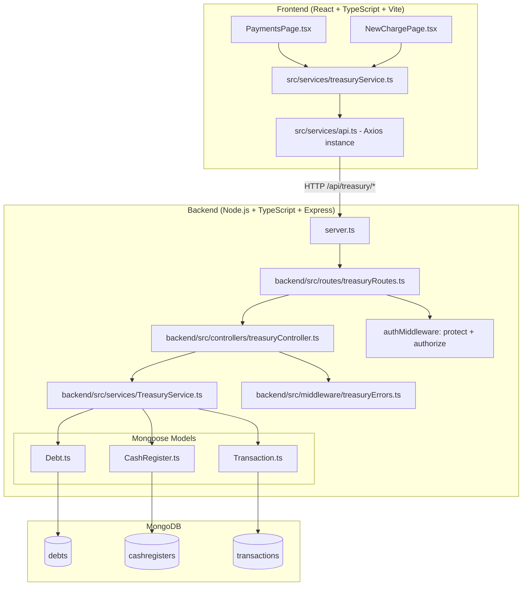
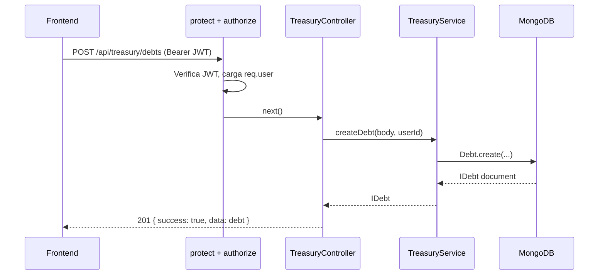

# Design Document: Treasury and Payments Module

## Overview

El módulo de Tesorería y Pagos de EduMF gestiona el ciclo completo de cobros escolares: creación de deudas por alumno, reporte y aprobación de transferencias bancarias, apertura/cierre de cajas diarias y registro de ingresos en efectivo. Se integra con el backend Node.js/TypeScript/Express/Mongoose existente bajo el prefijo `/api/treasury` y alimenta las páginas `PaymentsPage` y `NewChargePage` del frontend React/TypeScript.

Todos los montos monetarios se almacenan como `Decimal128` de MongoDB para evitar errores de precisión de punto flotante. Las operaciones que modifican múltiples documentos (aprobar transferencia, registrar ingreso en caja) se ejecutan dentro de sesiones MongoDB para garantizar atomicidad.

---

## 1. Arquitectura General

### Diagrama de Capas



### Flujo de una Petición



---

## 2. Diseño de Modelos Mongoose

### 2.1 Modelo Debt (`backend/src/models/Debt.ts`)

```typescript
import mongoose, { Schema, Document } from 'mongoose';

export type DebtStatus = 'PENDIENTE' | 'EN_VALIDACION' | 'PAGADO' | 'VENCIDO' | 'ANULADO';

export interface IDebt extends Document {
  studentId: mongoose.Types.ObjectId;
  concept: string;
  amount: mongoose.Types.Decimal128;
  dueDate: Date;
  status: DebtStatus;
  voucherUrl?: string;
  createdAt: Date;
  updatedAt: Date;
}

const DebtSchema = new Schema<IDebt>(
  {
    studentId: {
      type: mongoose.Schema.Types.ObjectId,
      ref: 'User',
      required: [true, 'El estudiante es requerido'],
    },
    concept: {
      type: String,
      required: [true, 'El concepto es requerido'],
      trim: true,
    },
    amount: {
      type: mongoose.Schema.Types.Decimal128,
      required: [true, 'El monto es requerido'],
    },
    dueDate: {
      type: Date,
      required: [true, 'La fecha de vencimiento es requerida'],
    },
    status: {
      type: String,
      enum: ['PENDIENTE', 'EN_VALIDACION', 'PAGADO', 'VENCIDO', 'ANULADO'],
      default: 'PENDIENTE',
    },
    voucherUrl: {
      type: String,
      trim: true,
    },
  },
  { timestamps: true }
);

// Serializar _id como id, omitir __v, serializar Decimal128 como string
DebtSchema.set('toJSON', {
  transform: (_doc, ret) => {
    ret.id = ret._id;
    delete ret._id;
    delete ret.__v;
    if (ret.amount) ret.amount = ret.amount.toString();
    return ret;
  },
});

DebtSchema.index({ studentId: 1 });
DebtSchema.index({ status: 1 });
DebtSchema.index({ concept: 'text' });
DebtSchema.index({ dueDate: 1 });

export default mongoose.model<IDebt>('Debt', DebtSchema);
```

### 2.2 Modelo CashRegister (`backend/src/models/CashRegister.ts`)

```typescript
import mongoose, { Schema, Document } from 'mongoose';

export type CashRegisterStatus = 'ABIERTA' | 'CERRADA';

export interface ICashRegister extends Document {
  openedByUserId: mongoose.Types.ObjectId;
  closedByUserId?: mongoose.Types.ObjectId;
  openedAt: Date;
  closedAt?: Date;
  initialBalance: mongoose.Types.Decimal128;
  expectedBalance: mongoose.Types.Decimal128;
  realBalance?: mongoose.Types.Decimal128;
  status: CashRegisterStatus;
  createdAt: Date;
  updatedAt: Date;
}

const CashRegisterSchema = new Schema<ICashRegister>(
  {
    openedByUserId: {
      type: mongoose.Schema.Types.ObjectId,
      ref: 'User',
      required: [true, 'El usuario que abre la caja es requerido'],
    },
    closedByUserId: {
      type: mongoose.Schema.Types.ObjectId,
      ref: 'User',
    },
    openedAt: {
      type: Date,
      required: [true, 'La fecha de apertura es requerida'],
      default: Date.now,
    },
    closedAt: {
      type: Date,
    },
    initialBalance: {
      type: mongoose.Schema.Types.Decimal128,
      required: [true, 'El saldo inicial es requerido'],
    },
    expectedBalance: {
      type: mongoose.Schema.Types.Decimal128,
      required: [true, 'El saldo esperado es requerido'],
    },
    realBalance: {
      type: mongoose.Schema.Types.Decimal128,
    },
    status: {
      type: String,
      enum: ['ABIERTA', 'CERRADA'],
      default: 'ABIERTA',
    },
  },
  { timestamps: true }
);

CashRegisterSchema.set('toJSON', {
  transform: (_doc, ret) => {
    ret.id = ret._id;
    delete ret._id;
    delete ret.__v;
    if (ret.initialBalance) ret.initialBalance = ret.initialBalance.toString();
    if (ret.expectedBalance) ret.expectedBalance = ret.expectedBalance.toString();
    if (ret.realBalance) ret.realBalance = ret.realBalance.toString();
    return ret;
  },
});

CashRegisterSchema.index({ openedByUserId: 1, status: 1 });
CashRegisterSchema.index({ openedAt: -1 });

export default mongoose.model<ICashRegister>('CashRegister', CashRegisterSchema);
```

### 2.3 Modelo Transaction (`backend/src/models/Transaction.ts`)

```typescript
import mongoose, { Schema, Document } from 'mongoose';

export type TransactionType = 'INGRESO' | 'EGRESO';
export type PaymentMethod = 'EFECTIVO' | 'TRANSFERENCIA' | 'TARJETA';

export interface ITransaction extends Document {
  cashRegisterId?: mongoose.Types.ObjectId;
  debtId?: mongoose.Types.ObjectId;
  type: TransactionType;
  paymentMethod: PaymentMethod;
  amount: mongoose.Types.Decimal128;
  voucherUrl?: string;
  registeredByUserId: mongoose.Types.ObjectId;
  createdAt: Date;
  updatedAt: Date;
}

const TransactionSchema = new Schema<ITransaction>(
  {
    cashRegisterId: {
      type: mongoose.Schema.Types.ObjectId,
      ref: 'CashRegister',
    },
    debtId: {
      type: mongoose.Schema.Types.ObjectId,
      ref: 'Debt',
    },
    type: {
      type: String,
      enum: ['INGRESO', 'EGRESO'],
      required: [true, 'El tipo de transacción es requerido'],
    },
    paymentMethod: {
      type: String,
      enum: ['EFECTIVO', 'TRANSFERENCIA', 'TARJETA'],
      required: [true, 'El método de pago es requerido'],
    },
    amount: {
      type: mongoose.Schema.Types.Decimal128,
      required: [true, 'El monto es requerido'],
    },
    voucherUrl: {
      type: String,
      trim: true,
    },
    registeredByUserId: {
      type: mongoose.Schema.Types.ObjectId,
      ref: 'User',
      required: [true, 'El usuario registrador es requerido'],
    },
  },
  { timestamps: true }
);

TransactionSchema.set('toJSON', {
  transform: (_doc, ret) => {
    ret.id = ret._id;
    delete ret._id;
    delete ret.__v;
    if (ret.amount) ret.amount = ret.amount.toString();
    return ret;
  },
});

TransactionSchema.index({ cashRegisterId: 1 });
TransactionSchema.index({ debtId: 1 });
TransactionSchema.index({ type: 1 });
TransactionSchema.index({ createdAt: -1 });

export default mongoose.model<ITransaction>('Transaction', TransactionSchema);
```

---

## 3. Errores Custom (`backend/src/middleware/treasuryErrors.ts`)

Extienden `ApiError` del middleware existente para expresar errores de dominio con semántica clara.

```typescript
import ApiError from './ApiError';

export class DebtNotFoundError extends ApiError {
  constructor(debtId: string) {
    super(`Deuda con id '${debtId}' no encontrada`, 404);
    Object.setPrototypeOf(this, DebtNotFoundError.prototype);
  }
}

export class InvalidPaymentStateError extends ApiError {
  constructor(currentStatus: string, expectedStatus: string) {
    super(
      `Transición de estado inválida: la deuda está en estado '${currentStatus}', se esperaba '${expectedStatus}'`,
      409
    );
    Object.setPrototypeOf(this, InvalidPaymentStateError.prototype);
  }
}

export class CashRegisterNotOpenError extends ApiError {
  constructor(cashRegisterId: string) {
    super(`La caja '${cashRegisterId}' no está abierta o no existe`, 409);
    Object.setPrototypeOf(this, CashRegisterNotOpenError.prototype);
  }
}

export class CashRegisterAlreadyOpenError extends ApiError {
  constructor() {
    super('Ya existe una caja abierta para este usuario', 409);
    Object.setPrototypeOf(this, CashRegisterAlreadyOpenError.prototype);
  }
}
```

El `errorHandler` global en `backend/src/middleware/errorHandler.ts` ya maneja cualquier instancia de `ApiError` (y sus subclases) devolviendo `{ success: false, message }` con el `statusCode` correspondiente, por lo que no se requiere ningún cambio en ese middleware.

---

## 4. Capa de Servicio (`backend/src/services/TreasuryService.ts`)

Encapsula toda la lógica de negocio. Los controladores solo validan la entrada HTTP y delegan en este servicio.

### Interfaz del Servicio

```typescript
import mongoose from 'mongoose';
import Debt, { IDebt, DebtStatus } from '../models/Debt';
import CashRegister, { ICashRegister } from '../models/CashRegister';
import Transaction, { ITransaction } from '../models/Transaction';
import {
  DebtNotFoundError,
  InvalidPaymentStateError,
  CashRegisterNotOpenError,
  CashRegisterAlreadyOpenError,
} from '../middleware/treasuryErrors';
import ApiError from '../middleware/ApiError';

//  Helpers de Decimal128 

/** Convierte string o number a Decimal128. Lanza ApiError 400 si el valor no es numérico. */
function toDecimal128(value: string | number, fieldName = 'amount'): mongoose.Types.Decimal128 {
  const str = String(value).trim();
  if (!/^\d+(\.\d+)?$/.test(str)) {
    throw ApiError.badRequest(`El campo '${fieldName}' debe ser un valor numérico válido`);
  }
  return mongoose.Types.Decimal128.fromString(str);
}

/** Suma un array de Decimal128 usando aritmética de strings (sin Number). */
function sumDecimal128(values: mongoose.Types.Decimal128[]): mongoose.Types.Decimal128 {
  // Convertir a BigInt con escala fija de 8 decimales para evitar float
  const SCALE = 100_000_000n;
  const total = values.reduce((acc, d) => {
    const parts = d.toString().split('.');
    const intPart = BigInt(parts[0]);
    const fracPart = parts[1] ? BigInt(parts[1].padEnd(8, '0').slice(0, 8)) : 0n;
    return acc + intPart * SCALE + fracPart;
  }, 0n);
  const intPart = total / SCALE;
  const fracPart = (total % SCALE).toString().padStart(8, '0').replace(/0+$/, '') || '0';
  return mongoose.Types.Decimal128.fromString(`${intPart}.${fracPart}`);
}

function subtractDecimal128(
  a: mongoose.Types.Decimal128,
  b: mongoose.Types.Decimal128
): mongoose.Types.Decimal128 {
  const SCALE = 100_000_000n;
  const toBigInt = (d: mongoose.Types.Decimal128) => {
    const parts = d.toString().split('.');
    const intPart = BigInt(parts[0]);
    const fracPart = parts[1] ? BigInt(parts[1].padEnd(8, '0').slice(0, 8)) : 0n;
    return intPart * SCALE + fracPart;
  };
  const result = toBigInt(a) - toBigInt(b);
  const intPart = result / SCALE;
  const fracPart = (result % SCALE).toString().padStart(8, '0').replace(/0+$/, '') || '0';
  return mongoose.Types.Decimal128.fromString(`${intPart}.${fracPart}`);
}

//  Métodos del Servicio 

export const TreasuryService = {

  //  Debts 

  async createDebt(data: {
    studentId: string;
    concept: string;
    amount: string | number;
    dueDate: string;
  }): Promise<IDebt> {
    const { studentId, concept, amount, dueDate } = data;
    if (!studentId || !concept || amount === undefined || !dueDate) {
      throw ApiError.badRequest('Los campos studentId, concept, amount y dueDate son requeridos');
    }
    const debt = await Debt.create({
      studentId: new mongoose.Types.ObjectId(studentId),
      concept,
      amount: toDecimal128(amount),
      dueDate: new Date(dueDate),
    });
    return debt;
  },

  async listDebts(query: {
    status?: string;
    studentId?: string;
    search?: string;
    page?: number;
    limit?: number;
  }): Promise<{ data: IDebt[]; total: number; page: number; limit: number; totalPages: number }> {
    const page = query.page || 1;
    const limit = query.limit || 10;
    const skip = (page - 1) * limit;
    const filter: any = {};

    if (query.status) filter.status = query.status;
    if (query.studentId) filter.studentId = new mongoose.Types.ObjectId(query.studentId);
    if (query.search) filter.concept = { $regex: query.search, $options: 'i' };

    const [data, total] = await Promise.all([
      Debt.find(filter).sort({ createdAt: -1 }).skip(skip).limit(limit),
      Debt.countDocuments(filter),
    ]);

    return { data, total, page, limit, totalPages: Math.ceil(total / limit) };
  },

  async getDebtById(id: string): Promise<IDebt> {
    const debt = await Debt.findById(id);
    if (!debt) throw new DebtNotFoundError(id);
    return debt;
  },

  async reportTransfer(debtId: string, voucherUrl: string, userId: string): Promise<IDebt> {
    const debt = await Debt.findById(debtId);
    if (!debt) throw new DebtNotFoundError(debtId);

    // Idempotencia: ya en EN_VALIDACION con el mismo voucher
    if (debt.status === 'EN_VALIDACION' && debt.voucherUrl === voucherUrl) {
      return debt;
    }

    if (debt.status !== 'PENDIENTE' && debt.status !== 'VENCIDO') {
      throw new InvalidPaymentStateError(debt.status, 'PENDIENTE o VENCIDO');
    }

    debt.status = 'EN_VALIDACION';
    debt.voucherUrl = voucherUrl;
    await debt.save();

    await Transaction.create({
      debtId: debt._id,
      type: 'INGRESO',
      paymentMethod: 'TRANSFERENCIA',
      amount: debt.amount,
      voucherUrl,
      registeredByUserId: new mongoose.Types.ObjectId(userId),
    });

    return debt;
  },

  async approveTransfer(debtId: string, adminUserId: string): Promise<IDebt> {
    const session = await mongoose.startSession();
    session.startTransaction();
    try {
      const debt = await Debt.findById(debtId).session(session);
      if (!debt) throw new DebtNotFoundError(debtId);
      if (debt.status !== 'EN_VALIDACION') {
        throw new InvalidPaymentStateError(debt.status, 'EN_VALIDACION');
      }

      debt.status = 'PAGADO';
      await debt.save({ session });

      await Transaction.create(
        [
          {
            debtId: debt._id,
            type: 'INGRESO',
            paymentMethod: 'TRANSFERENCIA',
            amount: debt.amount,
            voucherUrl: debt.voucherUrl,
            registeredByUserId: new mongoose.Types.ObjectId(adminUserId),
          },
        ],
        { session }
      );

      await session.commitTransaction();
      return debt;
    } catch (err) {
      await session.abortTransaction();
      throw err;
    } finally {
      session.endSession();
    }
  },

  //  CashRegisters 

  async openCashRegister(data: {
    initialBalance: string | number;
    userId: string;
  }): Promise<ICashRegister> {
    const { initialBalance, userId } = data;
    const existing = await CashRegister.findOne({
      openedByUserId: new mongoose.Types.ObjectId(userId),
      status: 'ABIERTA',
    });
    if (existing) throw new CashRegisterAlreadyOpenError();

    const balance = toDecimal128(initialBalance, 'initialBalance');
    const cashRegister = await CashRegister.create({
      openedByUserId: new mongoose.Types.ObjectId(userId),
      openedAt: new Date(),
      initialBalance: balance,
      expectedBalance: balance,
    });
    return cashRegister;
  },

  async registerIncome(data: {
    cashRegisterId: string;
    debtId: string;
    amount: string | number;
    userId: string;
  }): Promise<{ cashRegister: ICashRegister; transaction: ITransaction }> {
    const { cashRegisterId, debtId, amount, userId } = data;
    const session = await mongoose.startSession();
    session.startTransaction();
    try {
      const cashRegister = await CashRegister.findById(cashRegisterId).session(session);
      if (!cashRegister || cashRegister.status !== 'ABIERTA') {
        throw new CashRegisterNotOpenError(cashRegisterId);
      }

      const debt = await Debt.findById(debtId).session(session);
      if (!debt) throw new DebtNotFoundError(debtId);

      const amountD128 = toDecimal128(amount);
      debt.status = 'PAGADO';
      await debt.save({ session });

      const [transaction] = await Transaction.create(
        [
          {
            cashRegisterId: cashRegister._id,
            debtId: debt._id,
            type: 'INGRESO',
            paymentMethod: 'EFECTIVO',
            amount: amountD128,
            registeredByUserId: new mongoose.Types.ObjectId(userId),
          },
        ],
        { session }
      );

      // Actualizar expectedBalance
      cashRegister.expectedBalance = sumDecimal128([cashRegister.expectedBalance, amountD128]);
      await cashRegister.save({ session });

      await session.commitTransaction();
      return { cashRegister, transaction };
    } catch (err) {
      await session.abortTransaction();
      throw err;
    } finally {
      session.endSession();
    }
  },

  async closeCashRegister(data: {
    cashRegisterId: string;
    realBalance: string | number;
    userId: string;
  }): Promise<ICashRegister> {
    const { cashRegisterId, realBalance, userId } = data;
    const cashRegister = await CashRegister.findById(cashRegisterId);
    if (!cashRegister) throw ApiError.notFound(`Caja '${cashRegisterId}' no encontrada`);
    if (cashRegister.status !== 'ABIERTA') {
      throw new CashRegisterNotOpenError(cashRegisterId);
    }

    // Calcular expectedBalance con Decimal128
    const ingresos = await Transaction.find({ cashRegisterId: cashRegister._id, type: 'INGRESO' });
    const egresos = await Transaction.find({ cashRegisterId: cashRegister._id, type: 'EGRESO' });

    const totalIngresos = sumDecimal128(ingresos.map((t) => t.amount));
    const totalEgresos = sumDecimal128(egresos.map((t) => t.amount));
    const expectedBalance = subtractDecimal128(
      sumDecimal128([cashRegister.initialBalance, totalIngresos]),
      totalEgresos
    );

    cashRegister.expectedBalance = expectedBalance;
    cashRegister.realBalance = toDecimal128(realBalance, 'realBalance');
    cashRegister.closedAt = new Date();
    cashRegister.closedByUserId = new mongoose.Types.ObjectId(userId);
    cashRegister.status = 'CERRADA';
    await cashRegister.save();
    return cashRegister;
  },

  async listCashRegisters(query: {
    page?: number;
    limit?: number;
  }): Promise<{ data: ICashRegister[]; total: number; page: number; limit: number; totalPages: number }> {
    const page = query.page || 1;
    const limit = query.limit || 10;
    const skip = (page - 1) * limit;

    const [data, total] = await Promise.all([
      CashRegister.find().sort({ openedAt: -1 }).skip(skip).limit(limit),
      CashRegister.countDocuments(),
    ]);

    return { data, total, page, limit, totalPages: Math.ceil(total / limit) };
  },

  async getCashRegisterById(id: string): Promise<{ cashRegister: ICashRegister; transactions: ITransaction[] }> {
    const cashRegister = await CashRegister.findById(id);
    if (!cashRegister) throw ApiError.notFound(`Caja '${id}' no encontrada`);
    const transactions = await Transaction.find({ cashRegisterId: cashRegister._id }).sort({ createdAt: -1 });
    return { cashRegister, transactions };
  },

  async listTransactions(query: { cashRegisterId?: string }): Promise<ITransaction[]> {
    const filter: any = {};
    if (query.cashRegisterId) filter.cashRegisterId = new mongoose.Types.ObjectId(query.cashRegisterId);
    return Transaction.find(filter).sort({ createdAt: -1 });
  },
};
```

---

## 5. Controladores y Rutas

### 5.1 Controlador (`backend/src/controllers/treasuryController.ts`)

El controlador sigue el patrón existente: `try/catch` con `next(error)`, respuestas `{ success: true, data }`.

```typescript
import { Request, Response, NextFunction } from 'express';
import { TreasuryService } from '../services/TreasuryService';
import ApiError from '../middleware/ApiError';

//  Debts 

// POST /api/treasury/debts
export const createDebt = async (req: Request, res: Response, next: NextFunction) => {
  try {
    const { studentId, concept, amount, dueDate } = req.body;
    if (!studentId || !concept || amount === undefined || !dueDate) {
      return next(ApiError.badRequest('studentId, concept, amount y dueDate son requeridos'));
    }
    const debt = await TreasuryService.createDebt({ studentId, concept, amount, dueDate });
    res.status(201).json({ success: true, data: debt });
  } catch (err) { next(err); }
};

// GET /api/treasury/debts
export const listDebts = async (req: Request, res: Response, next: NextFunction) => {
  try {
    const { status, studentId, search, page, limit } = req.query;
    const result = await TreasuryService.listDebts({
      status: status as string,
      studentId: studentId as string,
      search: search as string,
      page: page ? parseInt(page as string) : undefined,
      limit: limit ? parseInt(limit as string) : undefined,
    });
    res.status(200).json({ success: true, ...result });
  } catch (err) { next(err); }
};

// GET /api/treasury/debts/:id
export const getDebtById = async (req: Request, res: Response, next: NextFunction) => {
  try {
    const debt = await TreasuryService.getDebtById(req.params.id);
    res.status(200).json({ success: true, data: debt });
  } catch (err) { next(err); }
};

// POST /api/treasury/debts/:id/report-transfer
export const reportTransfer = async (req: Request, res: Response, next: NextFunction) => {
  try {
    const { voucherUrl } = req.body;
    if (!voucherUrl) return next(ApiError.badRequest('voucherUrl es requerido'));
    const debt = await TreasuryService.reportTransfer(req.params.id, voucherUrl, req.user.id);
    res.status(200).json({ success: true, data: debt });
  } catch (err) { next(err); }
};

//  Validations 

// POST /api/treasury/validations/:id/approve
export const approveTransfer = async (req: Request, res: Response, next: NextFunction) => {
  try {
    const debt = await TreasuryService.approveTransfer(req.params.id, req.user.id);
    res.status(200).json({ success: true, data: debt });
  } catch (err) { next(err); }
};

//  CashRegisters 

// POST /api/treasury/cash-registers/open
export const openCashRegister = async (req: Request, res: Response, next: NextFunction) => {
  try {
    const { initialBalance } = req.body;
    if (initialBalance === undefined) return next(ApiError.badRequest('initialBalance es requerido'));
    const cashRegister = await TreasuryService.openCashRegister({ initialBalance, userId: req.user.id });
    res.status(201).json({ success: true, data: cashRegister });
  } catch (err) { next(err); }
};

// POST /api/treasury/cash-registers/:id/income
export const registerIncome = async (req: Request, res: Response, next: NextFunction) => {
  try {
    const { debtId, amount } = req.body;
    if (!debtId || amount === undefined) return next(ApiError.badRequest('debtId y amount son requeridos'));
    const result = await TreasuryService.registerIncome({
      cashRegisterId: req.params.id,
      debtId,
      amount,
      userId: req.user.id,
    });
    res.status(200).json({ success: true, data: result });
  } catch (err) { next(err); }
};

// POST /api/treasury/cash-registers/:id/close
export const closeCashRegister = async (req: Request, res: Response, next: NextFunction) => {
  try {
    const { realBalance } = req.body;
    if (realBalance === undefined) return next(ApiError.badRequest('realBalance es requerido'));
    const cashRegister = await TreasuryService.closeCashRegister({
      cashRegisterId: req.params.id,
      realBalance,
      userId: req.user.id,
    });
    res.status(200).json({ success: true, data: cashRegister });
  } catch (err) { next(err); }
};

// GET /api/treasury/cash-registers
export const listCashRegisters = async (req: Request, res: Response, next: NextFunction) => {
  try {
    const { page, limit } = req.query;
    const result = await TreasuryService.listCashRegisters({
      page: page ? parseInt(page as string) : undefined,
      limit: limit ? parseInt(limit as string) : undefined,
    });
    res.status(200).json({ success: true, ...result });
  } catch (err) { next(err); }
};

// GET /api/treasury/cash-registers/:id
export const getCashRegisterById = async (req: Request, res: Response, next: NextFunction) => {
  try {
    const result = await TreasuryService.getCashRegisterById(req.params.id);
    res.status(200).json({ success: true, data: result });
  } catch (err) { next(err); }
};

// GET /api/treasury/transactions
export const listTransactions = async (req: Request, res: Response, next: NextFunction) => {
  try {
    const { cashRegisterId } = req.query;
    const transactions = await TreasuryService.listTransactions({ cashRegisterId: cashRegisterId as string });
    res.status(200).json({ success: true, data: transactions });
  } catch (err) { next(err); }
};
```

### 5.2 Rutas (`backend/src/routes/treasuryRoutes.ts`)

```typescript
import { Router } from 'express';
import { protect, authorize } from '../middleware/authMiddleware';
import {
  createDebt, listDebts, getDebtById, reportTransfer,
  approveTransfer,
  openCashRegister, registerIncome, closeCashRegister,
  listCashRegisters, getCashRegisterById,
  listTransactions,
} from '../controllers/treasuryController';

const router = Router();

// Todas las rutas requieren autenticación
router.use(protect);

//  Debts 
router.post('/debts', authorize('admin'), createDebt);
router.get('/debts', listDebts);
router.get('/debts/:id', getDebtById);
router.post('/debts/:id/report-transfer', reportTransfer); // cualquier usuario autenticado

//  Validations 
router.post('/validations/:id/approve', authorize('admin'), approveTransfer);

//  CashRegisters 
router.post('/cash-registers/open', authorize('admin'), openCashRegister);
router.post('/cash-registers/:id/income', authorize('admin'), registerIncome);
router.post('/cash-registers/:id/close', authorize('admin'), closeCashRegister);
router.get('/cash-registers', authorize('admin'), listCashRegisters);
router.get('/cash-registers/:id', authorize('admin'), getCashRegisterById);

//  Transactions 
router.get('/transactions', authorize('admin'), listTransactions);

export default router;
```

### 5.3 Tabla de Endpoints

| Método | Ruta | Auth | Descripción |
|--------|------|------|-------------|
| POST | `/api/treasury/debts` | admin | Crear deuda |
| GET | `/api/treasury/debts` | any | Listar deudas (paginado, filtros) |
| GET | `/api/treasury/debts/:id` | any | Obtener deuda por id |
| POST | `/api/treasury/debts/:id/report-transfer` | any | Reportar transferencia |
| POST | `/api/treasury/validations/:id/approve` | admin | Aprobar transferencia |
| POST | `/api/treasury/cash-registers/open` | admin | Abrir caja |
| POST | `/api/treasury/cash-registers/:id/income` | admin | Registrar ingreso en caja |
| POST | `/api/treasury/cash-registers/:id/close` | admin | Cerrar caja |
| GET | `/api/treasury/cash-registers` | admin | Listar cajas (paginado) |
| GET | `/api/treasury/cash-registers/:id` | admin | Obtener caja con transacciones |
| GET | `/api/treasury/transactions` | admin | Listar transacciones |

---

## 6. Servicio Frontend (`src/services/treasuryService.ts`)

Usa la instancia `api` de Axios ya configurada con el interceptor de JWT y el redirect a `/login` en 401.

```typescript
import { api } from './api';

//  Tipos 

export type DebtStatus = 'PENDIENTE' | 'EN_VALIDACION' | 'PAGADO' | 'VENCIDO' | 'ANULADO';
export type CashRegisterStatus = 'ABIERTA' | 'CERRADA';
export type TransactionType = 'INGRESO' | 'EGRESO';
export type PaymentMethod = 'EFECTIVO' | 'TRANSFERENCIA' | 'TARJETA';

export interface Debt {
  id: string;
  studentId: string;
  concept: string;
  amount: string;       // Decimal128 serializado como string
  dueDate: string;      // ISO date string
  status: DebtStatus;
  voucherUrl?: string;
  createdAt: string;
  updatedAt: string;
}

export interface CashRegister {
  id: string;
  openedByUserId: string;
  closedByUserId?: string;
  openedAt: string;
  closedAt?: string;
  initialBalance: string;
  expectedBalance: string;
  realBalance?: string;
  status: CashRegisterStatus;
  createdAt: string;
  updatedAt: string;
}

export interface Transaction {
  id: string;
  cashRegisterId?: string;
  debtId?: string;
  type: TransactionType;
  paymentMethod: PaymentMethod;
  amount: string;
  voucherUrl?: string;
  registeredByUserId: string;
  createdAt: string;
  updatedAt: string;
}

export interface PaginatedResponse<T> {
  success: boolean;
  data: T[];
  total: number;
  page: number;
  limit: number;
  totalPages: number;
}

export interface CreateDebtPayload {
  studentId: string;
  concept: string;
  amount: string;
  dueDate: string;
}

export interface ListDebtsQuery {
  status?: DebtStatus;
  studentId?: string;
  search?: string;
  page?: number;
  limit?: number;
}

//  Servicio 

export const treasuryService = {

  //  Debts 

  async createDebt(payload: CreateDebtPayload): Promise<Debt> {
    const response = await api.post<{ success: boolean; data: Debt }>('/treasury/debts', payload);
    return response.data.data;
  },

  async listDebts(query: ListDebtsQuery = {}): Promise<PaginatedResponse<Debt>> {
    const response = await api.get<PaginatedResponse<Debt>>('/treasury/debts', { params: query });
    return response.data;
  },

  async getDebtById(id: string): Promise<Debt> {
    const response = await api.get<{ success: boolean; data: Debt }>(`/treasury/debts/${id}`);
    return response.data.data;
  },

  async reportTransfer(debtId: string, voucherUrl: string): Promise<Debt> {
    const response = await api.post<{ success: boolean; data: Debt }>(
      `/treasury/debts/${debtId}/report-transfer`,
      { voucherUrl }
    );
    return response.data.data;
  },

  async approveTransfer(debtId: string): Promise<Debt> {
    const response = await api.post<{ success: boolean; data: Debt }>(
      `/treasury/validations/${debtId}/approve`
    );
    return response.data.data;
  },

  //  CashRegisters 

  async openCashRegister(initialBalance: string): Promise<CashRegister> {
    const response = await api.post<{ success: boolean; data: CashRegister }>(
      '/treasury/cash-registers/open',
      { initialBalance }
    );
    return response.data.data;
  },

  async registerIncome(cashRegisterId: string, debtId: string, amount: string): Promise<{ cashRegister: CashRegister; transaction: Transaction }> {
    const response = await api.post<{ success: boolean; data: { cashRegister: CashRegister; transaction: Transaction } }>(
      `/treasury/cash-registers/${cashRegisterId}/income`,
      { debtId, amount }
    );
    return response.data.data;
  },

  async closeCashRegister(cashRegisterId: string, realBalance: string): Promise<CashRegister> {
    const response = await api.post<{ success: boolean; data: CashRegister }>(
      `/treasury/cash-registers/${cashRegisterId}/close`,
      { realBalance }
    );
    return response.data.data;
  },

  async listCashRegisters(page = 1, limit = 10): Promise<PaginatedResponse<CashRegister>> {
    const response = await api.get<PaginatedResponse<CashRegister>>('/treasury/cash-registers', {
      params: { page, limit },
    });
    return response.data;
  },

  async getCashRegisterById(id: string): Promise<{ cashRegister: CashRegister; transactions: Transaction[] }> {
    const response = await api.get<{ success: boolean; data: { cashRegister: CashRegister; transactions: Transaction[] } }>(
      `/treasury/cash-registers/${id}`
    );
    return response.data.data;
  },

  async listTransactions(cashRegisterId?: string): Promise<Transaction[]> {
    const response = await api.get<{ success: boolean; data: Transaction[] }>('/treasury/transactions', {
      params: cashRegisterId ? { cashRegisterId } : {},
    });
    return response.data.data;
  },
};
```

---

## 7. Integración con `server.ts`

Agregar la importación y el registro de la ruta treasury en `backend/src/server.ts`:

```typescript
// Agregar junto a los demás imports de rutas
import treasuryRoutes from './routes/treasuryRoutes';

// Agregar junto a los demás app.use(...)
app.use('/api/treasury', treasuryRoutes);
```

El `errorHandler` ya está registrado al final de todos los `app.use(...)`, por lo que los errores de treasury serán capturados automáticamente.

---

## 8. Diagramas de Flujo de Operaciones Clave

### 8.1 Flujo: Aprobar Transferencia (con sesión MongoDB)

```mermaid
sequenceDiagram
    participant Admin as Admin (Frontend)
    participant CTRL as TreasuryController
    participant SVC as TreasuryService
    participant DB as MongoDB Session

    Admin->>CTRL: POST /api/treasury/validations/:id/approve
    CTRL->>SVC: approveTransfer(debtId, adminUserId)
    SVC->>DB: startSession() + startTransaction()
    SVC->>DB: Debt.findById(debtId).session(session)
    alt Debt no existe
        DB-->>SVC: null
        SVC->>DB: abortTransaction()
        SVC-->>CTRL: DebtNotFoundError (404)
    else status != EN_VALIDACION
        SVC->>DB: abortTransaction()
        SVC-->>CTRL: InvalidPaymentStateError (409)
    else status == EN_VALIDACION
        SVC->>DB: debt.status = PAGADO; debt.save({session})
        SVC->>DB: Transaction.create([...], {session})
        alt Transaction falla
            DB-->>SVC: Error
            SVC->>DB: abortTransaction()
            SVC-->>CTRL: Error (500)
        else Todo OK
            SVC->>DB: commitTransaction()
            SVC-->>CTRL: IDebt (PAGADO)
            CTRL-->>Admin: 200 { success: true, data: debt }
        end
    end
```

### 8.2 Flujo: Registrar Ingreso en Caja (con sesión MongoDB)

```mermaid
sequenceDiagram
    participant Admin as Admin (Frontend)
    participant CTRL as TreasuryController
    participant SVC as TreasuryService
    participant DB as MongoDB Session

    Admin->>CTRL: POST /api/treasury/cash-registers/:id/income
    CTRL->>SVC: registerIncome(cashRegisterId, debtId, amount, userId)
    SVC->>DB: startSession() + startTransaction()
    SVC->>DB: CashRegister.findById(id).session(session)
    alt CashRegister no existe o CERRADA
        SVC->>DB: abortTransaction()
        SVC-->>CTRL: CashRegisterNotOpenError (409)
    else
        SVC->>DB: Debt.findById(debtId).session(session)
        alt Debt no existe
            SVC->>DB: abortTransaction()
            SVC-->>CTRL: DebtNotFoundError (404)
        else
            SVC->>DB: debt.status = PAGADO; debt.save({session})
            SVC->>DB: Transaction.create([...], {session})
            SVC->>DB: cashRegister.expectedBalance += amount; cashRegister.save({session})
            SVC->>DB: commitTransaction()
            SVC-->>CTRL: { cashRegister, transaction }
            CTRL-->>Admin: 200 { success: true, data: {...} }
        end
    end
```

---

## 9. Propiedades de Corrección (Property-Based Testing)

Estas propiedades son invariantes del sistema que deben mantenerse bajo cualquier secuencia de operaciones válidas. Se expresan como aserciones verificables con una librería de PBT (e.g., `fast-check` para TypeScript).

### 9.1 Precisión Monetaria

**Propiedad**: Para cualquier monto `m` representable como string decimal con hasta 8 decimales, la conversión a Decimal128 y de vuelta a string produce el mismo valor.

```typescript
// fast-check property
fc.property(
  fc.float({ min: 0.01, max: 999999.99, noNaN: true }),
  (amount) => {
    const str = amount.toFixed(2);
    const d128 = mongoose.Types.Decimal128.fromString(str);
    return d128.toString() === str;
  }
)
```

**Propiedad**: `sumDecimal128([a, b]) === sumDecimal128([b, a])` (conmutatividad).

**Propiedad**: `sumDecimal128([a, b, c]) === sumDecimal128([sumDecimal128([a, b]), c])` (asociatividad).

**Propiedad**: `subtractDecimal128(sumDecimal128([a, b]), b) === a` (inverso de suma).

### 9.2 Transiciones de Estado de Deuda

**Propiedad**: Una deuda en estado `PAGADO` o `ANULADO` nunca puede transicionar a otro estado mediante `reportTransfer` o `approveTransfer`.

```typescript
// Para cualquier deuda con status in ['PAGADO', 'ANULADO']:
// reportTransfer(debtId, voucherUrl) lanza InvalidPaymentStateError (409)
// approveTransfer(debtId) lanza InvalidPaymentStateError (409)
```

**Propiedad**: `reportTransfer` solo acepta deudas en `PENDIENTE` o `VENCIDO`. Para cualquier otro estado, lanza `InvalidPaymentStateError`.

**Propiedad**: `approveTransfer` solo acepta deudas en `EN_VALIDACION`. Para cualquier otro estado, lanza `InvalidPaymentStateError`.

**Propiedad (idempotencia)**: Llamar `reportTransfer(debtId, sameVoucherUrl)` dos veces cuando la deuda ya está en `EN_VALIDACION` con el mismo `voucherUrl` devuelve HTTP 200 sin crear un segundo `Transaction`.

### 9.3 Atomicidad de Sesiones MongoDB

**Propiedad**: Si `approveTransfer` falla durante la creación del `Transaction`, el estado de la `Debt` permanece `EN_VALIDACION` (no `PAGADO`).

**Propiedad**: Si `registerIncome` falla durante la actualización del `CashRegister.expectedBalance`, el estado de la `Debt` permanece sin cambios y no se crea ningún `Transaction`.

### 9.4 Invariantes de CashRegister

**Propiedad**: Al cerrar una caja, `expectedBalance = initialBalance + sum(INGRESO transactions) - sum(EGRESO transactions)` calculado con Decimal128.

```typescript
// Para cualquier CashRegister cerrada:
// expectedBalance.toString() ===
//   subtractDecimal128(
//     sumDecimal128([initialBalance, ...ingresos.map(t => t.amount)]),
//     sumDecimal128(egresos.map(t => t.amount))
//   ).toString()
```

**Propiedad**: No puede existir más de una `CashRegister` con `status = 'ABIERTA'` para el mismo `openedByUserId`.

**Propiedad**: Una `CashRegister` con `status = 'CERRADA'` no puede recibir nuevos `Transaction` mediante `registerIncome`.

### 9.5 Paginación

**Propiedad**: Para cualquier colección de `n` deudas y `limit = k`, el número de páginas es `ceil(n / k)`.

**Propiedad**: La suma de elementos en todas las páginas es igual al `total` reportado.

**Propiedad**: Los elementos en la página `p` con `limit = k` son los mismos que `Debt.find().skip((p-1)*k).limit(k)`.

### 9.6 Serialización de Decimal128

**Propiedad**: Todos los campos monetarios en las respuestas JSON son strings (no `number`), verificable con `typeof response.amount === 'string'`.

**Propiedad**: Los strings de montos en respuestas JSON son parseables como números decimales válidos: `/^\d+\.\d+$/`.

---
